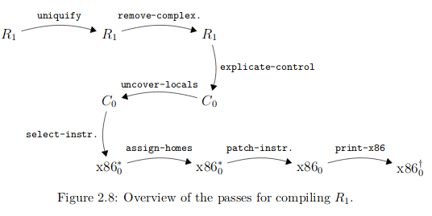

# rcc
A compiler for the R language

<p align="center">
  
</p>

Book: https://github.com/IUCompilerCourse/Essentials-of-Compilation

## R1

```
exp ::= int | (read) | (-exp) | (+exp exp) | var | (let ([var exp]) exp)
R1  ::=  (program info exp)
```
